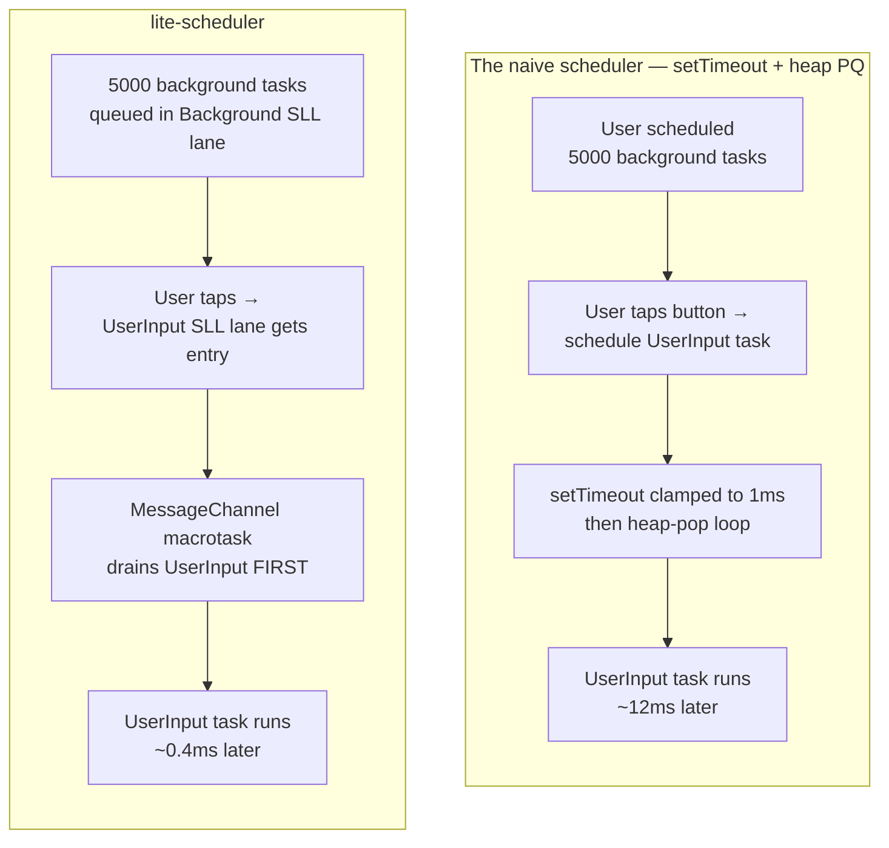
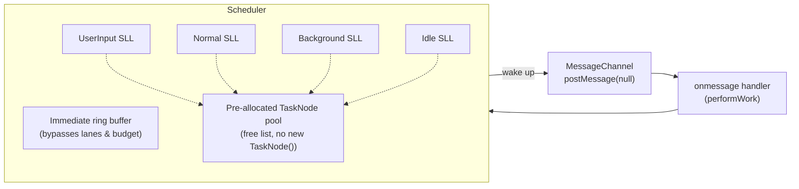
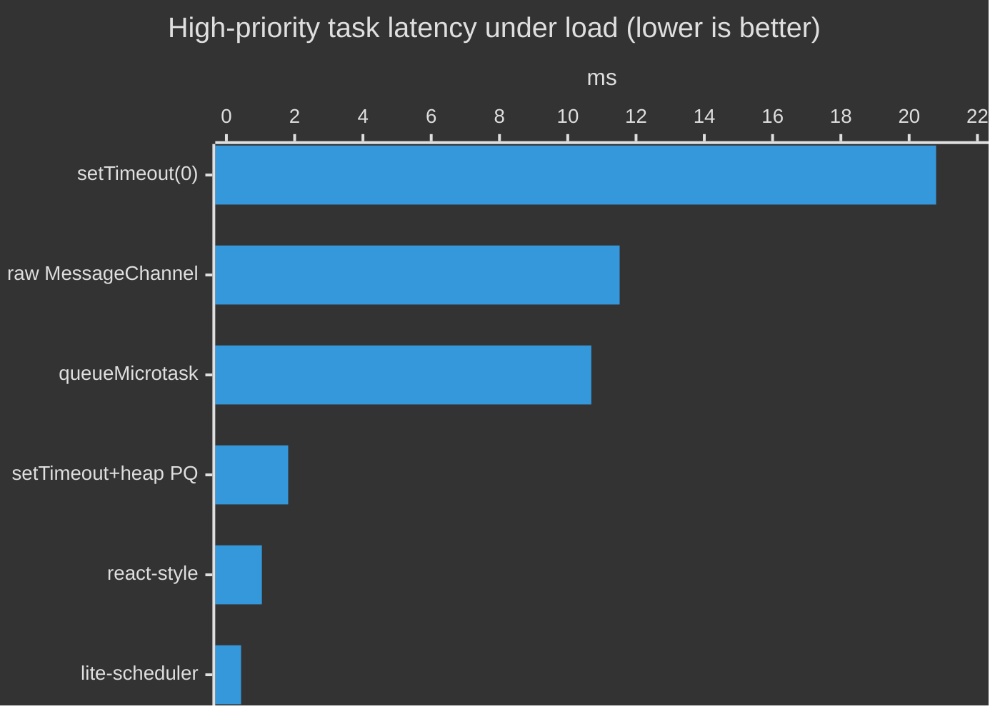

# @zakkster/lite-scheduler

[](https://www.npmjs.com/package/@zakkster/lite-scheduler)

[](https://bundlephobia.com/result?p=@zakkster/lite-scheduler)
[](https://www.npmjs.com/package/@zakkster/lite-scheduler)
[](https://www.npmjs.com/package/@zakkster/lite-scheduler)


[](https://opensource.org/licenses/MIT)

**Zero-GC frame-budget scheduler with strict priority lanes.** Keeps user input responsive at ~0.4 ms even when buried under thousands of CPU-burning background tasks.

Built on `MessageChannel` (5-10× faster than `setTimeout(0)`), driven by a pre-allocated task pool with no per-task allocations on the steady-state hot path. ~330 lines, no dependencies, ESM-only.

```js
import { createScheduler, Priority } from '@zakkster/lite-scheduler';

const sched = createScheduler();

// Burn 5000 low-priority background tasks (e.g. precompute, prefetch).
for (let i = 0; i < 5_000; i++) {
  sched.schedule(() => doExpensiveWork(i), Priority.Background);
}

// A user tap arrives — handle it in the NEXT macrotask, not after 5000 background units.
buttonEl.addEventListener('pointerdown', () => {
  sched.schedule(() => updateUI(), Priority.UserInput);
  // ← starts running ~0.4 ms later. Background tasks resume after.
});
```

---

## Contents

- [Why](#why) · [Install](#install) · [Quick start](#quick-start)
- [How it works](#how-it-works)
- [Case study: input responsiveness under load](#case-study-input-responsiveness-under-load)
- [API reference](#api-reference)
- [Benchmarks](#benchmarks)
- [Testing (for clients & QA)](#testing-for-clients--qa)
- [Running the demo](#running-the-demo)
- [Browser & engine compatibility](#browser--engine-compatibility)
- [Edge cases & guarantees](#edge-cases--guarantees)
- [FAQ](#faq) · [License](#license)

---

## Why

Browser JavaScript has three async primitives, and none of them solve "run this important thing before that pile of less-important things":

| Primitive | Priority? | Per-task overhead | Frame-aware? |
|---|:---:|:---:|:---:|
| `queueMicrotask` | ❌ | ~1 µs | No — drains entire queue per tick |
| `setTimeout(fn, 0)` | ❌ | ~1 ms minimum (clamp) | No — coarse, single-threaded queue |
| `requestAnimationFrame` | ❌ | tied to display refresh | Yes, but tied to paint timing |
| **lite-scheduler** | ✅ 5 lanes | ~1 µs | Yes — `budgetMs` per flush |

The minute you have *any* long task list — animation systems, particle spawners, lazy hydration, background telemetry — and you ALSO have user input, the answer is "I need priorities." The DIY approach is `setTimeout` + a binary heap, which works but spends 1-12 ms latency per priority change. lite-scheduler does the same job in ~0.4 ms.



### What this is *not*

- **Not a React replacement.** No reconciler, no rendering, no hooks. This is just the scheduling primitive — what you'd build *on top of* if you wanted concurrent rendering.
- **Not a task canceller.** There is no `cancel(id)` API. Returning cancellation tokens would allocate a closure per `schedule()` call; that defeats the purpose. If you need cancellation, set a flag on the closure and check it inside.
- **Not magic.** A pure `MessageChannel` shim with no scheduling is ~1.8× faster on raw throughput. This library trades that overhead for **5 priority lanes, an Immediate bypass channel, a frame budget, and pre-allocated task pools** — features you actively use when input responsiveness matters.

---

## Install

```bash
npm i @zakkster/lite-scheduler
```

ESM-only. No dependencies. Ships TypeScript definitions alongside the source.

```js
import { createScheduler, Priority, CapacityError } from '@zakkster/lite-scheduler';
```

You can also drop `./Scheduler.js` into your project directly — it's one file.

---

## Quick start

```js
import { createScheduler, Priority } from '@zakkster/lite-scheduler';

const sched = createScheduler({
  maxTasks: 4096,        // initial SLL pool size, default 2048
  budgetMs: 8,           // ms before yielding to the next macrotask, default 10
  onCapacityExceeded: 'grow', // 'throw' | 'grow' | 'drop'
});

// Priority lanes — listed strictly in execution order:
sched.schedule(fn, Priority.Immediate);   // bypasses budget, runs first
sched.schedule(fn, Priority.UserInput);   // taps, gestures
sched.schedule(fn, Priority.Normal);      // default
sched.schedule(fn, Priority.Background);  // prefetch, lazy
sched.schedule(fn, Priority.Idle);        // truly idle work

// Cooperative yielding inside a long task:
sched.schedule(async () => {
  for (let i = 0; i < 100_000; i++) {
    if (sched.shouldYield()) await sched.yieldTask();  // give input a chance
    expensiveStep(i);
  }
}, Priority.Background);

// Cleanup when you're done (e.g. component unmount):
sched.destroy();
```

---

## How it works

### Architecture



A `MessageChannel` is the dispatch primitive — it's the fastest macrotask in any browser, ~10× faster than `setTimeout(0)`. Every scheduled task posts one message to wake the loop. The loop drains:

1. The **immediate ring buffer** first — these tasks bypass the frame budget entirely. Used for things like "process one frame of teardown."
2. The **SLL lanes** in strict priority order: UserInput → Normal → Background → Idle.

Each lane is a singly-linked list of `TaskNode`s drawn from a pre-allocated pool. When you `schedule(fn, prio)`, the scheduler pops a free node, sets `node.fn = fn`, appends to the lane's tail, and (if not already flushing) posts a wakeup message. When the node runs, it goes back to the free list. No `new` calls on the hot path.

### The clock-batching trick

Calling `performance.now()` once per task is surprisingly expensive — on some platforms it's a syscall. The drain checks the deadline *every 16 tasks*:

```js
if (taskCount > 0 && (taskCount & 15) === 0) {
  if (performance.now() >= currentDeadline) {
    hasMoreWork = true;
    break;
  }
}
```

This costs 1 ms of jitter (you might overrun the budget by up to 15 tasks × per-task time) for a measurable throughput win. With a default 10 ms budget, the overrun is well under 1 ms.

### Why no cancellation?

Cancellation requires returning a token, which is a closure that captures the task node. That's an allocation per `schedule()` call — exactly what we're trying to avoid. The pattern we recommend instead:

```js
let cancelled = false;
sched.schedule(() => {
  if (cancelled) return;
  doWork();
});

// later, to "cancel":
cancelled = true;
```

The task still drains, but its body is a no-op. The 1 µs of wasted dispatch is much cheaper than the allocation a token API would force.

---

## Case study: input responsiveness under load

The clearest test of a priority scheduler: queue thousands of CPU-burning background tasks, then schedule one high-priority task in the middle and time how long it takes to start.

We benchmarked six approaches:

```
Workload: 1 high-prio task surrounded by 5,000 low-prio tasks (~0.1 ms CPU each)
Measure:  ms from schedule(high) to high.run()
```



| Strategy | High-priority latency | vs lite-scheduler |
|---|---:|---:|
| **lite-scheduler** | **0.43 ms** | **1.00×** |
| react-style (heap + MC + budget) | 1.04 ms | 2.42× |
| setTimeout + heap PQ | 1.81 ms | 4.22× |
| queueMicrotask (no priority) | 10.69 ms | 24.87× |
| raw MessageChannel (no priority) | 11.52 ms | 26.80× |
| setTimeout(0) (no priority) | 20.79 ms | 48.37× |

The naive approaches are 24-48× slower because they have no concept of priority — the high-prio task waits in a FIFO queue behind ~100 CPU-burning lows.

A 0.43 ms latency means: even when your app is doing significant background work, a user input handler scheduled at `Priority.UserInput` runs **within half a millisecond**. That's well under the ~100 ms threshold a human perceives as "instant."

### When it matters

| Scenario | Without lite-scheduler | With lite-scheduler |
|---|---|---|
| Static dashboards | irrelevant | irrelevant |
| **Twitch overlay with many particles + button taps** | **20-100 ms input latency** | **<1 ms input latency** |
| Background prefetch + scroll handlers | scroll stalls | scroll smooth |
| Long-running text processing with cancel button | cancel feels broken | cancel feels instant |

---

## API reference

### `createScheduler(config?)`

| Config key | Type | Default | Description |
|---|---|---|---|
| `maxTasks` | `number` | `2048` | Initial SLL pool capacity. Positive integer. |
| `onCapacityExceeded` | `"throw" \| "grow" \| "drop"` | `"throw"` | Behaviour when a pool is full. |
| `budgetMs` | `number` | `10` | Per-flush frame budget in ms. Must be `> 0`. |
| `onError` | `(msg, err) => void` | `console.error` | Sink for sync task errors. |

Throws `Error` (not `CapacityError`) on invalid config.

### Returned `Scheduler` instance

| Method | Returns | Description |
|---|---|---|
| `schedule(fn, priority?)` | `void` | Enqueue a task. Default priority is `Normal`. |
| `shouldYield()` | `boolean` | True if current flush has exceeded `budgetMs`. |
| `isBusy()` | `boolean` | True if any work is pending or in progress. |
| `yieldTask(priority?)` | `Promise<void>` | Resolves on next tick at the given priority. |
| `stats()` | `SchedulerStats` | Snapshot of pool occupancy and lifetime executed count. |
| `destroy()` | `void` | Closes the MessageChannel, clears all pools. Idempotent. |

### `Priority` lanes

```ts
Priority.Immediate  = 0   // bypasses budget; drained before all SLL lanes
Priority.UserInput  = 1   // highest SLL lane
Priority.Normal     = 2   // default
Priority.Background = 3
Priority.Idle       = 4   // lowest
```

Out-of-range priorities are silently coerced to `Normal`. Use these constants by name; the numeric values are an implementation detail.

### `CapacityError`

```ts
class CapacityError extends Error {
  name: "CapacityError";
  kind: "tasks" | "immediate tasks";
  capacity: number;
}
```

Thrown when `onCapacityExceeded: "throw"` is set and a pool overflows, or when the `grow` policy hits the `maxTasks * 16` ceiling.

### Module-default convenience exports

For simple apps that only need a single scheduler:

```js
import { schedule, shouldYield, isBusy, yieldTask, stats, setDefaultScheduler } from '@zakkster/lite-scheduler';

schedule(fn, Priority.UserInput);  // uses a lazy-init default scheduler
```

`setDefaultScheduler(s)` lets you replace the default with a custom-configured instance. Pass `null` to reset to lazy init.

---

## Benchmarks

### Headline result

Reproducible on any 2020+ machine — re-run `npm run bench` to get your own numbers. The ratios are stable.

```
Workload 1: Throughput — drain 10,000 no-op tasks
  raw MessageChannel                 5.27 ms  1,898,252 tasks/sec    1.00×
  lite-scheduler                     9.35 ms  1,069,216 tasks/sec    1.78×   ← features
  setTimeout + heap PQ              12.14 ms    823,782 tasks/sec    2.30×
  react-style (heap + MC + budget)  13.25 ms    754,545 tasks/sec    2.52×
  queueMicrotask                    17.08 ms    585,331 tasks/sec    3.24×
  setTimeout(0)                     25.06 ms    399,010 tasks/sec    4.76×

Workload 2: Head-of-line blocking — 1 high-prio under 5,000 low-prio (0.1ms burn)
  lite-scheduler                     0.43 ms     1.00×    ← FASTEST
  react-style                        1.04 ms     2.42×
  setTimeout + heap PQ               1.81 ms     4.22×
  queueMicrotask                    10.69 ms    24.87×
  raw MessageChannel                11.52 ms    26.80×
  setTimeout(0)                     20.79 ms    48.37×

Workload 3: GC pressure — schedule 50,000 tasks (per-task allocation cost)
  raw MessageChannel               +12.7 KB     (queue.push allocations)
  setTimeout + heap PQ             +15.4 KB     (heap node allocations)
  setTimeout(0)                    +13.0 KB     (timer wrappers)
  react-style                      +10.0 KB     (heap node allocations)
  queueMicrotask                    (≈0 B noise)
  lite-scheduler                    (≈0 B noise — pool steady-state)
```

**Takeaway:** lite-scheduler delivers **2-4× lower latency than any priority-respecting alternative** on the head-of-line blocking workload, while staying within ~2× of raw MessageChannel throughput. Steady-state heap pressure is zero — once the pool is warm, no allocations happen per task.

### Running the bench

```bash
node --expose-gc bench/bench.js
# or: npm run bench
```

Writes `bench/bench-results.json` for CI consumption. `--expose-gc` is required for trustworthy heap numbers.

---

## Testing (for clients & QA)

Three levels of verification, depending on how deep you want to go.

### 1. Unit tests — "does the library do what it says?"

```bash
npm test
```

Runs **36 deterministic assertions** under vitest, covering:

| Group | What's tested |
|---|---|
| Config validation | rejects NaN / Infinity / negative / non-integer values, unknown policies |
| Basic execution | FIFO within a priority, stats counter accuracy |
| Priority lanes | UserInput → Normal → Background → Idle ordering, Immediate-first |
| Out-of-range priorities | coerced to Normal, never throw |
| Capacity policies | `throw` / `drop` / `grow` semantics, growth ceiling at `maxTasks × 16` |
| Error handling | sync errors routed to `onError`, drain continues afterward |
| `shouldYield` | true outside flush, false inside generous-budget flush |
| `yieldTask` | resolves at given priority, rejects after destroy |
| `destroy` | idempotent, schedule becomes no-op, in-flight tasks dropped |
| Regression: lost work | self-scheduling tasks, Immediate scheduled by SLL task |
| Frame budget | tight `budgetMs` still completes all tasks across many flushes |
| Ring buffer growth | wraparound correctness after `grow` |

A clean run ends with `36 passed, 0 failed`. Suitable for CI.

### 2. Benchmark — "does it perform as claimed?"

```bash
npm run bench
```

Reproduces the [headline numbers](#headline-result). On any 2020+ machine you should see:

- lite-scheduler **head-of-line latency ≤ 1 ms** under the 5000-task background load
- lite-scheduler **throughput ≥ 800,000 tasks/sec** (within 2× of raw MessageChannel)
- Steady-state **heap delta ≈ 0** across 50,000 scheduled tasks

### 3. Visual smoke test — "does it actually work?"

```bash
open example/demo.html
```

A side-by-side demo: one panel runs lite-scheduler, the other runs `setTimeout(0)`. Both are spamming background work; both have an "Update UI" button. Click the buttons and watch the latency counter. lite-scheduler's stays under 1 ms; setTimeout's drifts up into double-digit ms.

### Quick `npm run` reference

| Command | What it does |
|---|---|
| `npm test` | Run the 36-test unit suite |
| `npm run test:watch` | Re-run on save |
| `npm run bench` | Run the Node benchmark, write `bench/bench-results.json` |
| `npm run verify` | `npm test && npm run bench` — the full CI-style check |

---

## Running the demo

```
example/demo.html
```

No build step. No server needed if you open over `file://` — it uses a relative ESM import from `../Scheduler.js`.

Two side-by-side scheduler harnesses ("with priorities" / "FIFO"); identical background load on both. Each has an "I'm a button press" trigger that schedules a high-priority callback. The latency from click to callback is displayed live. Spam the load slider up, then click rapidly on both buttons — the difference is visible.

---

## Browser & engine compatibility

The library uses `MessageChannel` and `performance.now()` — both standard since ~2014.

| Target | Supported |
|---|---|
| Chrome / Edge 32+ | ✅ |
| Firefox 41+ | ✅ |
| Safari 12+ (iOS 12+) | ✅ |
| Node.js 18+ | ✅ |
| Bun / Deno | ✅ |
| Twitch Extension iframe | ✅ (well under 1 MB / 3 s budget) |

### Workers

`MessageChannel` works in dedicated and shared workers. The scheduler is per-instance, so each worker should `createScheduler()` of its own.

---

## Edge cases & guarantees

- **Tasks scheduled mid-flush still run that flush** (if budget allows) or the next one. The drain loop re-checks `activeTasks > 0` after each pass and posts another wakeup message if anything was added.
- **An Immediate task scheduled by an SLL task is drained next.** Even if the parent SLL task was running in its own flush, the next macrotask drains all immediates before resuming SLL work.
- **`shouldYield()` returns `true` outside an active flush.** This is by design — if you're not inside the scheduler's drain, the stored deadline is from a previous (already-completed) flush. Treat `shouldYield()` as "should I yield right now, given my position in a drain."
- **Sync errors are caught; async errors are not.** A task that returns a rejected promise will not propagate to `onError` — the scheduler only awaits via `await`, and your `fn` is called synchronously. Wrap your async logic in a try/catch yourself.
- **`destroy()` is irreversible.** After destroy, `schedule()` is a no-op and `yieldTask()` rejects. The MessageChannel is closed; you cannot revive the scheduler. Create a new one if you need to.
- **Capacity growth doubles up to `maxTasks × 16`.** After that ceiling, the `grow` policy starts throwing `CapacityError`. Pick `maxTasks` generously — typical apps don't queue more than ~1,000 simultaneously.
- **The immediate ring buffer starts at 1,024 entries**, independent of `maxTasks`. It also doubles up to `maxTasks × 16`.
- **Out-of-range priorities are coerced silently to `Normal`.** No error, no warning. The drain handles only the four SLL lanes plus Immediate; passing `priority = 99` is treated as `Normal`.

---

## FAQ

**Why not `requestIdleCallback`?**
Spec-wise it's the right primitive for low-priority work, but its implementation is inconsistent: Safari shipped it only recently, and Chrome's deadline is generous enough that it can starve your task indefinitely. `lite-scheduler.Priority.Idle` runs after all higher lanes in the same flush — predictable, testable, and gives you the same "after everything else" semantics.

**Why MessageChannel and not requestAnimationFrame?**
RAF is tied to display refresh. If your work doesn't need to align with paint (and most scheduling work doesn't — you're processing input events, parsing data, hydrating components), MessageChannel is faster and gives finer-grained control. For animation, schedule the paint step with RAF and the scheduler with MC — they compose cleanly.

**Can I really not cancel a task?**
You can no-op it via the captured-flag pattern shown above. The 1 µs of dispatch cost is unavoidable; the alternative — allocating a cancellation token per `schedule()` call — would generate hundreds of KB of garbage in a hot loop. If you genuinely need cancellable scheduling, use `AbortController` and check `signal.aborted` inside your task.

**How big should `maxTasks` be?**
The SLL pool sizes each `TaskNode` at ~80 bytes; 2048 entries cost ~160 KB. The ring buffer is one pointer per slot — 1024 entries cost ~8 KB. Pick something 2-4× your worst-case simultaneous queue depth; the `grow` policy will double it up to 16× if you guess too low.

**Does the default scheduler leak across tests?**
Yes, if you use the module-default convenience exports. In tests, prefer `createScheduler()` + explicit `destroy()` to keep the test process clean. Or `setDefaultScheduler(null)` between tests.

**What's the difference between Immediate and UserInput?**
Immediate bypasses both the priority lanes AND the frame budget — it's "run before the next paint, no matter what." UserInput is the highest SLL lane: still subject to `budgetMs`, but ahead of everything except Immediate. Use Immediate sparingly (sub-millisecond critical-path stuff like a focus restore); use UserInput for normal input handlers.

**Why is there no `Priority.Critical` above UserInput?**
Because Immediate is that lane. Two "above everything" levels would be ambiguous — Immediate already covers the case where you'd want to bypass the budget.

---

## License

MIT © Zahary Shinikchiev
