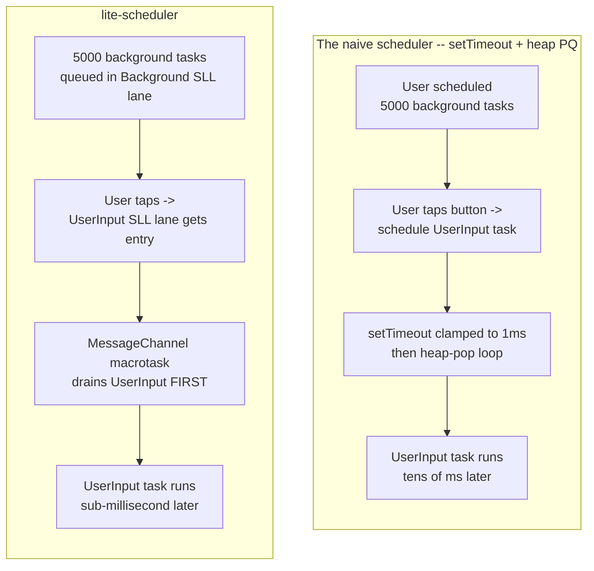
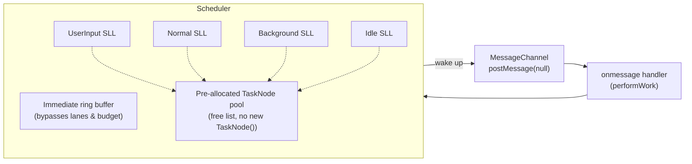

# @zakkster/lite-scheduler

[](https://www.npmjs.com/package/@zakkster/lite-scheduler)
[](https://github.com/sponsors/PeshoVurtoleta)

[](https://bundlephobia.com/result?p=@zakkster/lite-scheduler)
[](https://www.npmjs.com/package/@zakkster/lite-scheduler)
[](https://www.npmjs.com/package/@zakkster/lite-scheduler)


[](https://opensource.org/licenses/MIT)

> Two independent zero-GC schedulers in one file. `createScheduler` is a
> MessageChannel-driven frame-budget manager with 5 strict priority lanes that
> keeps user input responsive under heavy background load. `FastBitScheduler` is
> a pure O(1) 32-tier priority queue over integer handles for engines and ECS.
> They share no code; import one and the other tree-shakes away.

---

## The scheduler pair the ecosystem was missing

The browser gives you `queueMicrotask`, `setTimeout(0)`, and
`requestAnimationFrame` -- none of which understand "run this important thing
before that pile of less-important things." This package ships the two schedulers
that do, from a single dependency-free ESM file:

- **`createScheduler`** owns TIME -- a MessageChannel wakeup, a per-flush
  `budgetMs`, cooperative yielding. It is the browser/UI tool.
- **`FastBitScheduler`** owns ROUTING -- pop the highest-priority integer handle
  in two instructions, zero allocation, however many tiers are live. It is the
  engine/ECS tool.

```bash
npm i @zakkster/lite-scheduler
```

ESM-only, zero dependencies, TypeScript definitions alongside the source. You can
also drop `./Scheduler.js` into a project directly -- it is one file.

**Frame member -- priority beats FIFO.** Queue thousands of background tasks, add
one user-input task last, and it still runs first:

```js
import { createScheduler, Priority } from '@zakkster/lite-scheduler';

const sched = createScheduler({ budgetMs: 8, maxTasks: 8192 });

// Queue ~5000 low-priority background tasks (precompute, prefetch, ...).
let userRan = false;
let backgroundBeforeUser = 0;
for (let i = 0; i < 5000; i++) {
  sched.schedule(() => { if (!userRan) backgroundBeforeUser++; }, Priority.Background);
}

// Scheduled LAST, but at UserInput: it still drains before every Background task.
sched.schedule(() => { userRan = true; }, Priority.UserInput);

// Let the scheduler drain, then report and clean up. (A browser app never polls
// like this -- the scheduler wakes itself; the loop only lets this demo exit.)
const settle = () => sched.isBusy()
  ? setTimeout(settle, 0)
  : (console.log('background tasks that ran before the user task:', backgroundBeforeUser), sched.destroy());
settle();
```

**FastBit member -- O(1) highest-priority pop.** Push integer handles at numeric
tiers, drain lowest-tier-first with FIFO within a tier:

```js
import { FastBitScheduler, EMPTY } from '@zakkster/lite-scheduler';

const q = new FastBitScheduler(1024, 32);   // 1024 slots/tier, 32 tiers
q.push(101, 2);   // handle 101 at priority 2
q.push(102, 0);   // handle 102 at priority 0 (highest)
q.push(103, 2);

// The canonical drain -- why EMPTY is exported:
let h;
const order = [];
while ((h = q.popMin()) !== EMPTY) order.push(h);
console.log(order.join(' '));   // 102 101 103 (min-tier first, FIFO within a tier)
```

Both members run on Node 18+, Chrome/Edge 32+, Firefox 41+, Safari 12+, Bun, and
Deno; the frame member needs `MessageChannel` and `performance.now()` (standard
since ~2014) and works in dedicated and shared Workers (one scheduler per
worker). The FastBit member is pure data and needs nothing but arithmetic.

---

## Table of contents

- [Why this exists](#why-this-exists)
- [What you get](#what-you-get)
- [Two schedulers, two jobs](#two-schedulers-two-jobs)
- [API reference](#api-reference)
- [The handle contract](#the-handle-contract)
- [Composability with the ecosystem](#composability-with-the-ecosystem)
- [Zero-GC design notes](#zero-gc-design-notes)
- [Benchmarks](#benchmarks)
- [Design decisions worth knowing](#design-decisions-worth-knowing)
- [Testing](#testing)
- [What this is not](#what-this-is-not)
- [Ecosystem](#ecosystem)
- [License](#license)

---

## Why this exists

Browser JavaScript has three async primitives, and none of them solve "run this
important thing before that pile of less-important things":

| Primitive | Priority? | Per-task overhead | Frame-aware? |
|---|:---:|:---:|:---:|
| `queueMicrotask` | no | ~1 µs | No -- drains the entire queue per tick |
| `setTimeout(fn, 0)` | no | ~1 ms minimum (clamp) | No -- coarse, single queue |
| `requestAnimationFrame` | no | tied to display refresh | Yes, but tied to paint |
| **lite-scheduler** | yes, 5 lanes | ~1 µs | Yes -- `budgetMs` per flush |

The minute you have *any* long task list -- animation systems, particle
spawners, lazy hydration, background telemetry -- and you ALSO have user input,
the answer is "I need priorities." The DIY approach is `setTimeout` + a binary
heap, which works but pays a per-priority-shift latency the frame scheduler
avoids by draining strict lanes off one MessageChannel wakeup. On the
head-of-line blocking workload the frame scheduler is an order of magnitude
faster than every priority-blind primitive and roughly 2x faster than a
React-style heap-and-budget scheduler -- see [Benchmarks](#benchmarks) for the
stamped numbers.



The second member exists for the other half of the problem. Once you understand
pure bit-mask routing over true power-of-two rings, "pop the highest-priority
handle" stops being a scan of lane heads and becomes a lowest-set-bit on a single
32-bit int. Games, ECS systems, audio-voice pools and particle jobs already live
in handle/SoA land; `FastBitScheduler` gives them constant-time priority
selection with zero GC and pairs with the frame member for a clock.

---

## What you get

Installing `@zakkster/lite-scheduler` hands you:

- **Two schedulers from one import.** `createScheduler` -- the MessageChannel
  frame-budget manager with 5 priority lanes; `FastBitScheduler` -- the O(1)
  32-tier priority queue over integer handles. One file, tree-shakeable apart.
- **TypeScript definitions for both members** (`Scheduler.d.ts`), hand-written
  and gated against the runtime so they cannot drift.
- **A machine-readable `llms.txt`** that names every export of both members, in
  both directions, for a sibling package's pipeline to read.
- **Zero runtime dependencies, ESM-only.** Drop `./Scheduler.js` into a project
  directly if you prefer; it is one file.
- **The guards that ship with it:** 122 `node:test` assertions (57 frame, 44
  FastBit, 14 surface-drift, 7 hermetic doc guards), 0 failures -- see
  [Testing](#testing).
- **A 7-file package** (~31.7 kB packed): the source, the `.d.ts`, this README,
  `llms.txt`, `CHANGELOG.md`, and the MIT `LICENSE`.

---

## Two schedulers, two jobs

<details>
<summary><strong>createScheduler -- the frame-budget mechanics</strong></summary>

A `MessageChannel` is the dispatch primitive: the fastest macrotask in any
browser, well ahead of `setTimeout(0)`. Every scheduled task posts one wakeup
message; the loop drains, in order:



1. The **immediate ring buffer** first -- these tasks bypass the frame budget
   entirely (e.g. "process one frame of teardown").
2. The **SLL lanes** in strict priority order: UserInput -> Normal -> Background
   -> Idle.

Each lane is a singly-linked list of `TaskNode`s drawn from a pre-allocated pool.
`schedule(fn, prio)` pops a free node, sets `node.fn = fn`, appends to the lane's
tail, and (if not already flushing) posts a wakeup. When the node runs it returns
to the free list -- no `new` calls on the hot path.

**The clock-batching trick.** Calling `performance.now()` once per task is
surprisingly expensive -- on some platforms it is a syscall. The drain checks the
deadline every 16 tasks instead:

```js
if (taskCount > 0 && (taskCount & 15) === 0) {
  if (performance.now() >= currentDeadline) {
    hasMoreWork = true;
    break;
  }
}
```

That trades up to 15 tasks of budget overrun for a measurable throughput win;
with the default 10 ms budget the overrun is well under 1 ms.

**Why no cancellation.** A cancel API returns a token -- a closure that captures
the task node -- which is an allocation per `schedule()` call, exactly what the
pool exists to avoid. The recommended pattern is a captured flag the task body
checks; see [Design decisions](#design-decisions-worth-knowing).

</details>

<details>
<summary><strong>FastBitScheduler -- the activeMask / lowest-set-bit walkthrough</strong></summary>

The queue keeps one true ring buffer per tier (a power-of-two `Int32Array` with
head/tail/count cursors) and a single 32-bit `activeMask` whose bit `p` is set
exactly when tier `p` holds at least one item. "Pop the highest priority" is then
two instructions, independent of how many tiers are populated:

- `lowest = mask & -mask` isolates the lowest set bit (the highest-priority
  non-empty tier, because bit 0 = priority 0 = highest);
- `p = 31 - Math.clz32(lowest)` turns that bit into the tier index.

Pop the head of `buckets[p]`, advance `heads[p] = (heads[p] + 1) & capMask`,
decrement `counts[p]`, and clear the mask bit when the tier empties. There is no
loop over tiers -- a queue with 32 live tiers routes in the same two instructions
as one with a single live tier. That is the property the naive linear scan cannot
match when the lowest populated tier is high (the scan walks `0..p`); the
[Benchmarks](#benchmarks) show the exact crossover.

Handles are stored in `Int32Array`, so `EMPTY` (-1) is the one out-of-band value
and `push` refuses any `-1`, negative, or non-integer -- which is what makes the
`while ((h = q.popMin()) !== EMPTY)` drain loop sound. See
[The handle contract](#the-handle-contract).

</details>

---

## API reference

### `createScheduler(config?)`

| Config key | Type | Default | Description |
|---|---|---|---|
| `maxTasks` | `number` | `2048` | Initial SLL pool capacity. Positive integer. |
| `onCapacityExceeded` | `"throw" \| "grow" \| "drop"` | `"throw"` | Behaviour when a pool is full. |
| `budgetMs` | `number` | `10` | Per-flush frame budget in ms. Must be `> 0`. |
| `onError` | `(msg, err) => void` | `console.error` | Sink for sync task errors. Must be callable if provided. |

Throws `Error` (not `CapacityError`) on invalid config, including an unknown key
(the nearest known key is named).

### Returned `Scheduler` instance

| Method | Returns | Description |
|---|---|---|
| `schedule(fn, priority?)` | `void` | Enqueue a task. Default priority `Normal`. Throws `TypeError` at the call site if `fn` is not a function; a silent no-op after `destroy()`. |
| `shouldYield()` | `boolean` | True if the current flush has exceeded `budgetMs`. Returns `true` outside an active flush, by design. |
| `isBusy()` | `boolean` | True if any work is pending or in progress. |
| `yieldTask(priority?)` | `Promise<void>` | Resolves on the next tick at the given priority. Rejects after `destroy()`. |
| `stats()` | `SchedulerStats` | Snapshot of pool occupancy and lifetime executed count. Allocates the snapshot object. |
| `destroy()` | `void` | Closes the MessageChannel, clears all pools. Idempotent and irreversible. |

Any priority that is not an integer in `[UserInput..Idle]` -- NaN, a fraction,
Infinity, a string, out of range -- coerces to `Normal`; `Immediate` (0) is
matched exactly, before coercion.

### Module-default convenience exports

```js
import { schedule, shouldYield, isBusy, yieldTask, stats, setDefaultScheduler } from '@zakkster/lite-scheduler';

schedule(fn, Priority.UserInput);  // uses a lazy-init default scheduler
```

`setDefaultScheduler(s)` installs a custom instance; pass `null` to reset to lazy
init. Prefer an explicit `createScheduler()` + `destroy()` in tests and libraries.

### `FastBitScheduler` -- second member (added in 1.1.0)

`new FastBitScheduler(capacityPerTier = 1024, numTiers = 32)`.

| Member | Complexity | Throws when |
|---|---|---|
| `push(handle, priority)` | O(1) | handle is not a non-negative Int32; priority not in `0..numTiers-1`; tier full |
| `popMin()` / `peekMin()` | O(1) | never (returns `EMPTY` = -1 when empty) |
| `peekPriority()` | O(1) | never (returns -1 when empty) |
| `sizeOf(priority)` | O(1) | priority not in `0..numTiers-1` |
| `isEmpty()` | O(1) | never |
| `clear()` | O(numTiers), cold | never (no reallocation) |
| `size` / `capacity` / `requestedCapacity` / `numTiers` | O(1) getters | never |

`capacity` rounds `capacityPerTier` up to a power of two, and the round-up is
observable (`capacity` vs `requestedCapacity`). Every constructor and `push`
rejection is a `RangeError` whose message starts `lite-scheduler:`.

### Constants

| Name | Value | Meaning |
|---|---|---|
| `Priority.Immediate` | `0` | Bypasses budget; drained before all SLL lanes |
| `Priority.UserInput` | `1` | Highest SLL lane |
| `Priority.Normal` | `2` | Default lane |
| `Priority.Background` | `3` | Below normal |
| `Priority.Idle` | `4` | Lowest lane |
| `EMPTY` | `-1` | Out-of-band return from `popMin` / `peekMin` |
| `capacityPerTier` ceiling | `2**24` (16777216) | Max ring slots per tier |
| `numTiers` range | `2..32` | 32 is the hard mask ceiling |
| `VERSION` | `"1.1.1"` | In sync with package.json and llms.txt |

`CapacityError` (frame member) carries `name`, `kind` (`"tasks"` or
`"immediate tasks"`), and `capacity`; it is thrown under the `"throw"` policy on
overflow, or when the `"grow"` policy hits the `maxTasks * 16` ceiling.

---

## The handle contract

`FastBitScheduler` stores non-negative Int32 handles -- indices into your own
arrays -- never objects. The contract is small and fails closed:

- **`EMPTY` (-1) is the one out-of-band value, and it is exported.** A stored `-1`
  would collide with it, so `push` refuses `-1`, any negative, and any
  non-integer. That refusal is what makes `while ((h = q.popMin()) !== EMPTY)`
  sound -- the sentinel can never be a real handle.
- **Storage is `Int32Array`, never `Float32Array`.** A float cannot represent
  integers above `2**24` exactly, so a float store would silently corrupt a large
  handle into a neighbouring row. `Int32Array` round-trips every non-negative
  Int32 bit-exact.
- **Priority is an integer `0..numTiers-1`, 0 highest.** JS shift is mod 32, so an
  unchecked `32` would alias tier 0; `push` throws instead.
- **A full tier throws; nothing is silently dropped.** Every rejection is a
  `RangeError` whose message starts `lite-scheduler:`, naming the door
  (item, capacity, numTiers, or priority) that refused the value.

---

## Composability with the ecosystem

The two members are the payoff of the dual design: `FastBitScheduler` is pure
data (it owns routing), `createScheduler` owns time. Pair them and you get a
frame-budgeted, priority-routed drain over live entities. The pipeline below
spawns entities in [`@zakkster/lite-arena`](https://www.npmjs.com/package/@zakkster/lite-arena),
routes their SLOT INDICES by tier through `FastBitScheduler`, and drains them
within `budgetMs` under the frame scheduler. It runs as-is and terminates:

```js
import { createScheduler, Priority, FastBitScheduler, EMPTY } from '@zakkster/lite-scheduler';
import { Arena } from '@zakkster/lite-arena';

// lite-arena spawns entities; FastBitScheduler routes SLOT INDICES by priority
// tier; the frame scheduler drains within budget via shouldYield().
const N = 2000;
const arena = new Arena(N);
const Pos = arena.registerComponent({ x: Float32Array });

// Store the arena slot INDEX (always >= 0), never the handle -- generational
// handles go negative once a slot passes generation 2048, and FastBitScheduler
// refuses a negative handle. The parallel `ents` array maps index -> handle.
const ents = [];
const fbq = new FastBitScheduler(N, 4);      // 4 priority tiers
for (let i = 0; i < N; i++) {
  const e = arena.spawn();
  Pos.add(e);
  ents.push(e);
  fbq.push(i, i & 3);                          // slot index i (>= 0) at tier i&3
}

// "Cancel" one in every seven -- despawn bumps the generation. No token is
// allocated; the pop-side isAlive() check IS the cancellation.
for (let i = 0; i < N; i += 7) arena.despawn(ents[i]);

const sched = createScheduler({ budgetMs: 8 });
let processed = 0, skipped = 0;

function drainFrame() {
  let h;
  // Drain highest-priority handles until the frame budget says yield.
  while (!sched.shouldYield() && (h = fbq.popMin()) !== EMPTY) {
    const e = ents[h];
    if (!arena.isAlive(e)) { skipped++; continue; }   // cancelled: skip, zero alloc
    Pos.data.x[Pos.idx(e)] += 1;
    processed++;
  }
  if (!fbq.isEmpty()) sched.schedule(drainFrame, Priority.Normal);   // more to do next frame
  else { console.log('processed', processed, 'skipped', skipped); sched.destroy(); }
}
sched.schedule(drainFrame, Priority.Normal);
```

Three caveats this pipeline makes concrete, each of them load-bearing:

1. **Store the slot INDEX, not the handle.** lite-arena handles are generational
   and go negative by design once a slot passes generation 2048;
   `FastBitScheduler` refuses a negative handle. Push the arena slot index (always
   `>= 0`) and keep handles in a parallel array. Validating liveness on pop
   (`arena.isAlive`) IS the zero-alloc cancellation pattern -- a "cancel" is a
   `despawn` that bumps the generation, and the pop skips the dead index without
   ever allocating a cancellation token.
2. **`FastBitScheduler` is pure data.** Nothing about it wakes up on its own; it
   has no timer and no macrotask. Pair it with the frame scheduler (or `rAF`) for
   TIME, as above.
3. **Tier naming is a consumer-side concern.** If you want named tiers, map them
   with [`@zakkster/lite-fastbit32`](https://www.npmjs.com/package/@zakkster/lite-fastbit32)'s
   `BitMapper` on YOUR side -- the scheduler never imports it. Hoist the indices
   once at init; `.get()` is not a hot-loop call:

```js
// Consumer-side only; NOT imported by FastBitScheduler.
import { BitMapper } from '@zakkster/lite-fastbit32';
const tiers = new BitMapper(['input', 'ai', 'physics', 'idle']);  // fail-closed names
const AI = tiers.get('ai');            // hoist at init
fbq.push(slotIndex, AI);               // hot loop uses the integer
```

---

## Zero-GC design notes

<details>
<summary><strong>What allocates, what never does</strong></summary>

The zero-GC guarantee is about the STEADY STATE, not construction. Allocation is
confined to setup and cold paths:

| Surface | Allocates? | When |
|---|---|---|
| `createScheduler()` | yes | once, at construction (pools, MessageChannel) |
| `grow` capacity policy | yes | cold, on pool doubling up to `maxTasks * 16` |
| `yieldTask()` | yes | one Promise per call (it is an await point, not a hot loop) |
| `stats()` | yes | one snapshot object per call |
| `new FastBitScheduler()` | yes | once, at construction (the per-tier rings + cursors) |
| `schedule` / flush steady state | **no** | free-list nodes are recycled |
| `push` / `popMin` / `peekMin` / `peekPriority` / `sizeOf` / `clear` | **no** | rings never grow or reallocate |

The gate that proves it, this session:

```
Measured on node v26.3.1, darwin arm64, 2026-09-14, @zakkster/lite-scheduler 1.1.0 source.

frame  (t6): majorsPerKOp=0  maxPauseMsPerOp=0.000  heap growth -0.005 MB over 100000 cycles
fastbit(t6): majorsPerKOp=0  maxPauseMsPerOp=0.000  backingBytes delta 0 over 200000 push/popMin pairs
soak  (t7): tracker.size() === 0 after 4096 create/destroy cycles
```

The bench's Workload 3 (GC pressure) reads the same way: steady-state heap delta
across 50,000 scheduled tasks is noise-floor zero once the pool is warm.

</details>

---

## Benchmarks

Measured on node v26.3.1, darwin arm64, 2026-09-14, @zakkster/lite-scheduler
1.1.0 source. Reproducible on any 2020+ machine -- re-run `npm run bench` for your
own numbers; the ratios are the portable result.

**Head-of-line blocking** -- 1 high-priority task scheduled in the middle of
5,000 low-priority CPU-burning tasks; latency from schedule to run:

| Strategy | High-prio latency | vs lite-scheduler |
|---|---:|---:|
| **lite-scheduler** | **0.119 ms** | **1.00x** |
| react-style (heap + MC + budget) | 0.232 ms | 1.95x |
| setTimeout + heap PQ | 1.447 ms | 12.13x |
| queueMicrotask (no priority) | 10.143 ms | 85.06x |
| raw MessageChannel (no priority) | 10.089 ms | 84.61x |
| setTimeout(0) (no priority) | 11.553 ms | 96.88x |

The priority-blind primitives are an order of magnitude slower because the
high-priority task waits in a FIFO queue behind the CPU-burning lows.

**Throughput** -- drain 10,000 no-op tasks:

| Strategy | ms | tasks/sec | vs best |
|---|---:|---:|---:|
| queueMicrotask | 0.627 | 15,957,438 | 1.00x |
| raw MessageChannel | 0.934 | 10,709,505 | 1.49x |
| **lite-scheduler** | **1.095** | **9,129,644** | **1.75x** |
| react-style | 1.846 | 5,417,608 | 2.95x |
| setTimeout(0) | 2.542 | 3,933,845 | 4.06x |
| setTimeout + heap PQ | 2.968 | 3,369,272 | 4.74x |

lite-scheduler stays within ~1.2x of raw MessageChannel throughput while adding 5
priority lanes, an Immediate bypass, a frame budget, and pre-allocated pools.
Steady-state heap delta across 50,000 scheduled tasks is noise-floor zero.

**FastBitScheduler.popMin floor** -- vs a naive 32-tier linear scan over the same
ring storage and a binary heap of `(priority, seq)` pairs; 512 items/tier,
pops/sec in M/s (higher is better):

| populated tiers | FastBit popMin | naive scan | binary heap |
|---:|---:|---:|---:|
| 1  | 32.9  | 29.3  | 20.5 |
| 2  | 42.4  | 40.0  | 31.8 |
| 8  | 100.1 | 66.1  | 26.9 |
| 32 | 120.0 | 137.0 | 20.6 |

The mask beats the `(priority, seq)` heap ~5.8x at every tier count, and beats the
naive scan while the lowest populated tier is high (1..8 tiers here, where the
scan pays for the distance to the lowest set bit). The **honest crossover** is at
32 populated tiers: tier 0 is always live, so the scan short-circuits immediately
and edges the mask (0.88x). The mask's value is that its O(1) is
distribution-independent -- it matters when the lowest populated tier is high or
unpredictable, which is the common ECS case.

```bash
node --expose-gc bench/bench.js          # frame member; writes bench/bench-results.json
node --expose-gc bench/fastbit-floor.mjs # FastBit floor (repo-only)
```

`--expose-gc` is required for trustworthy heap numbers.

---

## Design decisions worth knowing

The design records live in `decisions/` (repo-only); the load-bearing ones:

- **One file, two independent members** (0002). `FastBitScheduler` ships from the
  same `Scheduler.js`, exported named, sharing no code with the frame scheduler;
  `sideEffects: false` lets a consumer tree-shake the member it does not import.
- **Storage: 32 rings, `Int32Array`** (0003). Per-tier rings won over one flat
  array; `Int32Array` (never `Float32Array`) is non-negotiable because a float
  store corrupts any handle above `2**24`.
- **Configurable `numTiers` 2..32** (0004). A 4- or 8-lane consumer should not pay
  for 32 rings; the mask still lives in one 32-bit int because bits above
  `numTiers-1` are never set.
- **No `drain(cb)`** (0005). A callback re-enters user code mid-mutation, while the
  mask and cursors are in flight. The consumer-written drain loop IS the API.
- **No cancellation token** (frame member). Returning a token allocates a closure
  per `schedule()` -- the exact garbage the pool exists to avoid. Use a captured
  flag the task body checks, or an `AbortController` + `signal.aborted`. In the
  handle world the same idea is free: a generation bump plus an `isAlive` check on
  pop (see [Composability](#composability-with-the-ecosystem)).
- **Throw at the door** (0001). A non-function task, a non-callable `onError`, and
  an unknown config key all fail synchronously at the call site -- never one
  macrotask later, disconnected from your stack.

---

## Testing

`npm test` runs the full `node:test` suite -- 122 assertions across four files,
0 failures:

| File | Count | Covers |
|---|---:|---|
| `test/Scheduler.test.js` | 57 | config validation, priority semantics, capacity policies, the lost-work regression, ring-buffer wraparound |
| `test/FastBitScheduler.test.js` | 44 | every door (item, capacity, numTiers, sizeOf), the full surface, the tier-31 sign bit, fill/throw/drain |
| `test/dts-drift.test.js` | 14 | version parity + both-member member parity, both directions, each with a mutation control |
| `test/docs.test.js` | 7 | spine order, relative links, ASCII, advertised-scripts-exist, provenance stamps |

The npm scripts, all of which exist:

| Command | What it does |
|---|---|
| `npm test` | Run the 122-test `node:test` suite |
| `npm run perf` | The `lite-perf-gate` zero-scavenge gate |
| `npm run torture` | The `lite-gc-profiler` + `lite-leak` gate |
| `npm run torture:controls` | Prove the gate fails without `--expose-gc` |
| `npm run bench` | Run the Node benchmark, write `bench/bench-results.json` |
| `npm run verify` | `test && perf && torture && torture:controls` -- the full CI check |

A repo-only `test/paste-run.mjs` executes every runnable code block in this README
and `llms.txt` from the repo root (it is not an npm script; it installs
`@zakkster/lite-arena` with `--no-save` for the Composability block).

### Visual smoke test

```bash
open example/demo.html
open example/demo-scheduler-arena.html
```

`example/demo.html` runs lite-scheduler and `setTimeout(0)` side by side under
identical background load, each with an "Update UI" button, and shows the
click-to-callback latency live. `example/demo-scheduler-arena.html` drives a
lite-arena particle field through `createScheduler`, with toggleable backends.
Both use relative ESM imports and need no build step; the arena demo uses an
import map, so a plain static server is simplest.

---

## What this is not

- **Not a job system or a thread pool.** There are no workers, no fan-out, no
  work-stealing. Both members are single-threaded primitives; put one in each
  Worker if you need parallelism.
- **Not `lodash.debounce` / `throttle`.** Those rate-limit one function against
  wall-clock time. This orders MANY tasks by priority within a frame budget.
- **Not a React replacement.** No reconciler, no rendering, no hooks -- this is
  the scheduling primitive you would build concurrent rendering *on top of*.
- **Not a task canceller.** There is no `cancel(id)`; a token would allocate per
  `schedule()`. Use the captured-flag pattern or `AbortController`.
- **Not magic throughput.** A raw MessageChannel shim is faster on pure
  throughput; the frame member trades that for priority lanes, an Immediate
  bypass, a frame budget, and pooled tasks -- features you use when input
  responsiveness matters.

---

## Ecosystem

Part of the `@zakkster/*` zero-GC ecosystem:

- [`@zakkster/lite-signal`](https://www.npmjs.com/package/@zakkster/lite-signal) --
  reactive graph
- [`@zakkster/lite-arena`](https://www.npmjs.com/package/@zakkster/lite-arena) --
  ECS with generational handles + SoA sparse sets
- [`@zakkster/lite-batch-buffer`](https://www.npmjs.com/package/@zakkster/lite-batch-buffer) --
  pre-allocated WebGL vertex buffer

They are designed to compose: the scheduler drives the frame, lite-arena manages
entity state, lite-batch-buffer streams vertices to the GPU, lite-signal
coordinates state changes. Together they fit comfortably inside Twitch's
1 MB / 3 s extension budget -- the FastBit member is the priority queue an
in-iframe engine reaches for, the frame member is its clock.

For the machine-readable surface (every export, both members, with the shared
invariants), see [llms.txt](llms.txt).

---

## License

MIT (c) Zahary Shinikchiev
